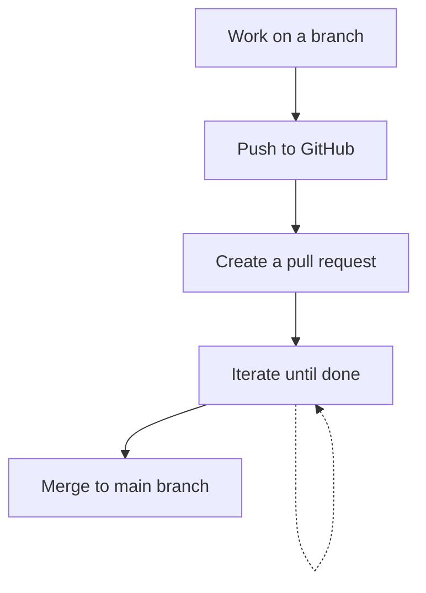

# TicTacToe

My development environment is configured using Vite with template `react-swc-ts`. See https://github.com/vitejs/vite/tree/main/packages/create-vite/template-react-ts

## Development

First run:

```
npm install
```

then run:

```
npm run dev
```

Run Vitest with:

```
npm run test
```


## Workflow

Work on a branch > push to GitHub > create a pull request > iterate until done > merge to main branch.



GitHub Actions will run `npm run test` on pull request creation and subsequent commits to the branch. The branch cannot be merged until tests pass.

## Deploying to production

GitHub Actions will deploy the site to https://rowlando.github.io/tictactoe/ whenever there is a push to the main branch.
